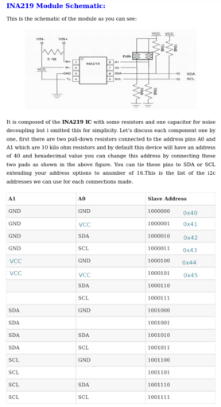

# GAW_Measure_Current
 Measure three currents (in mA) for my model railroad.

## Components
Components used are:
- 1 x Arduino nano
- 1 x ACS712 current measurement module
- 2 x INA219 I2C current measurement modules
- 1 x and I2C 16x2 LCD display

## Notes

### ACS712
The ACS712 library did not give very reliable results (or I didn't understand it properly),
so I ditched the use of that. Instead I found code to address the module myself and implemented that.
It measures the DCC square waves and gives results that are within around 20 mA boundaries.

### INA219
The INA219 modules do their work properly. For these I coded the interface myself as well, 
using the Wire library

## Pictures

